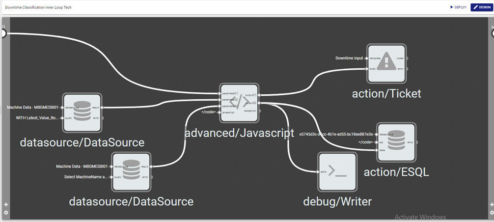

# Downtime-Classification-Triggering-Using-V-ONE
This code will check for the current row and previous row of the machine data from the SQL database and compares them in order to trigger an E-Ticket when there is an abnormal change using V-ONE by utilizing 2 workflows which is named inner and outer loop. 

# The Workflow

This workflow will grab the last 2 record and compare the values to identify if the machine has entered a downtime state during the operation. If the machine has been indentified to enter the downtime, a ticket will be triggered which will prompt the user to classify the reason behind the downtime which will assit the operators to pinpoint the common downtime issues on their site. 

